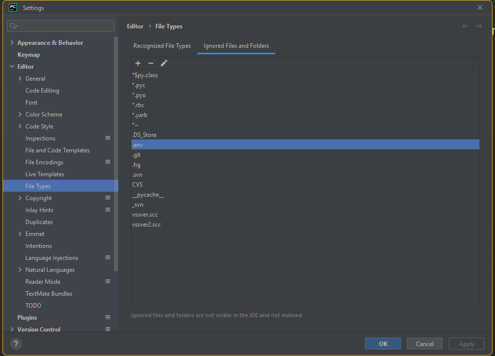

# Setup

set up your venv or whatever.

`pip install python-dotenv`

## Hide the .env from the project browser, so you don't accidentally open it
Add the .env file to ignored files in intellij settings

